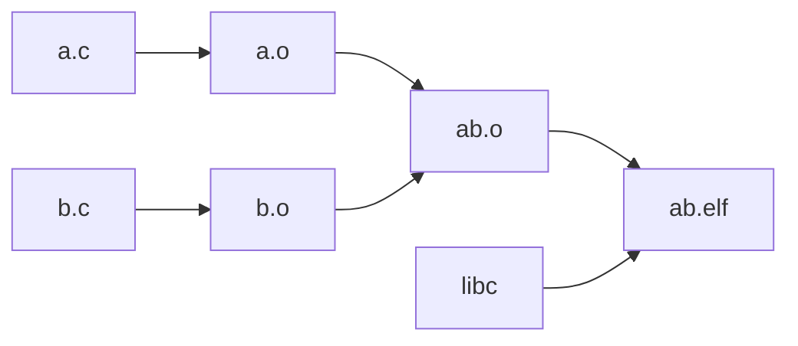
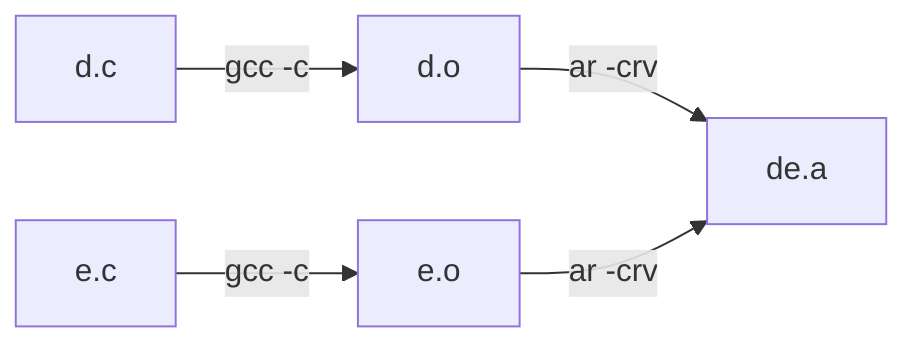
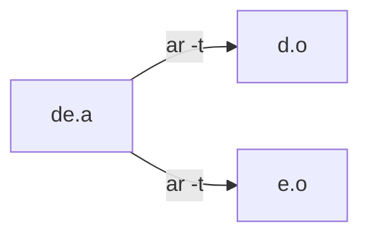

# 03_ELF文件_静态链接

## 1. Pre-condition

前面两节是对单独的c文件编译出的elf文件进行解析，静态链接是对多个c文件编译出的二进制文件进行合并的过程。我们对下面的简单的c文件进行静态链接。本文基于aarch64 armv8体系架构编译出的文件对多个目标文件的链接过程做出探究。



### 1.1 c文件

**File1: a.c**

```c
extern int b_share;
extern int b_func(int c, int d);

static int a_0 = 0x7f;
static const char *a_1 = "aaaaaaaaaaaa";
static int a_3;
static int a_4 = 0;

static int a_func(int a, int b)
{
    return a - b;
}

int main(void)
{
    int m = 0;
    a_0 ++;
    a_1[5];
    a_3 = 1;
    a_4 = 5;
    m = b_func(m, b_share);
    m = a_func(m, b_share);
    return 0;
}
```

**File2: b.c**

```C
int b_share = 0xFF;

static int b_0 = 0x7f;
static const char *b_1 = "hello world";
static int b_3;
static int b_4 = 0;

int b_func(int c, int d)
{
    static int b_5 = 0xAA;
    int a = 0;
    b_0 ++;
    b_1[5];
    b_3 = 1;
    b_4 = 5;
    a = c + d;
    return a;
}
```

### 1.2 o及asm文件

编译： `aarch64-linux-gnu-gcc -c a.c b.c` 分别编译出`a.o`, `b.o`

我们查看一下a.o和b.o的具体的指令段

**`aarch64-linux-gnu-objdump -s -d a.o`：**

```assembly
a.o:     file format elf64-littleaarch64

Contents of section .text:
 0000 ff4300d1 e00f00b9 e10b00b9 e10f40b9  .C............@.
 0010 e00b40b9 2000004b ff430091 c0035fd6  ..@. ..K.C...._.
 0020 fd7bbea9 fd030091 bf1f00b9 00000090  .{..............
 0030 00000091 000040b9 01040011 00000090  ......@.........
 0040 00000091 010000b9 00000090 00000091  ................
 0050 21008052 010000b9 00000090 00000091  !..R............
 0060 a1008052 010000b9 00000090 00000091  ...R............
 0070 000040b9 e103002a a01f40b9 00000094  ..@....*..@.....
 0080 a01f00b9 00000090 00000091 000040b9  ..............@.
 0090 e103002a a01f40b9 daffff97 a01f00b9  ...*..@.........
 00a0 00008052 fd7bc2a8 c0035fd6           ...R.{...._.    
Contents of section .data:
 0000 7f000000 00000000 00000000 00000000  ................
Contents of section .rodata:
 0000 61616161 61616161 61616161 00        aaaaaaaaaaaa.   
Contents of section .comment:
 0000 00474343 3a20284c 696e6172 6f204743  .GCC: (Linaro GC
 0010 4320372e 352d3230 31392e31 32292037  C 7.5-2019.12) 7
 0020 2e352e30 00                          .5.0.           

Disassembly of section .text:

0000000000000000 <a_func>:
   0:   d10043ff        sub     sp, sp, #0x10
   4:   b9000fe0        str     w0, [sp, #12]
   8:   b9000be1        str     w1, [sp, #8]
   c:   b9400fe1        ldr     w1, [sp, #12]
  10:   b9400be0        ldr     w0, [sp, #8]
  14:   4b000020        sub     w0, w1, w0
  18:   910043ff        add     sp, sp, #0x10
  1c:   d65f03c0        ret

0000000000000020 <main>:
  20:   a9be7bfd        stp     x29, x30, [sp, #-32]!
  24:   910003fd        mov     x29, sp
  28:   b9001fbf        str     wzr, [x29, #28]
  2c:   90000000        adrp    x0, 0 <a_func>
  30:   91000000        add     x0, x0, #0x0
  34:   b9400000        ldr     w0, [x0]
  38:   11000401        add     w1, w0, #0x1
  3c:   90000000        adrp    x0, 0 <a_func>
  40:   91000000        add     x0, x0, #0x0
  44:   b9000001        str     w1, [x0]
  48:   90000000        adrp    x0, 0 <a_func>
  4c:   91000000        add     x0, x0, #0x0
  50:   52800021        mov     w1, #0x1                        // #1
  54:   b9000001        str     w1, [x0]
  58:   90000000        adrp    x0, 0 <a_func>
  5c:   91000000        add     x0, x0, #0x0
  60:   528000a1        mov     w1, #0x5                        // #5
  64:   b9000001        str     w1, [x0]
  68:   90000000        adrp    x0, 0 <b_share>
  6c:   91000000        add     x0, x0, #0x0
  70:   b9400000        ldr     w0, [x0]
  74:   2a0003e1        mov     w1, w0
  78:   b9401fa0        ldr     w0, [x29, #28]
  7c:   94000000        bl      0 <b_func>
  80:   b9001fa0        str     w0, [x29, #28]
  84:   90000000        adrp    x0, 0 <b_share>
  88:   91000000        add     x0, x0, #0x0
  8c:   b9400000        ldr     w0, [x0]
  90:   2a0003e1        mov     w1, w0
  94:   b9401fa0        ldr     w0, [x29, #28]
  98:   97ffffda        bl      0 <a_func>
  9c:   b9001fa0        str     w0, [x29, #28]
  a0:   52800000        mov     w0, #0x0                        // #0
  a4:   a8c27bfd        ldp     x29, x30, [sp], #32
  a8:   d65f03c0        ret
```

**`aarch64-linux-gnu-objdump -s -d b.o`：**

```assembly
$ aarch64-linux-gnu-objdump -s -d b.o

b.o:     file format elf64-littleaarch64

Contents of section .text:
 0000 ff8300d1 e00f00b9 e10b00b9 ff1f00b9  ................
 0010 e10f40b9 e00b40b9 2000000b e01f00b9  ..@...@. .......
 0020 e01f40b9 ff830091 c0035fd6           ..@......._.    
Contents of section .data:
 0000 ff000000                             ....            
Contents of section .comment:
 0000 00474343 3a202847 4e552054 6f6f6c63  .GCC: (GNU Toolc
 0010 6861696e 20666f72 20746865 2041726d  hain for the Arm
 0020 20417263 68697465 63747572 65203131   Architecture 11
 0030 2e322d32 3032322e 30322028 61726d2d  .2-2022.02 (arm-
 0040 31312e31 34292920 31312e32 2e312032  11.14)) 11.2.1 2
 0050 30323230 31313100                    0220111.        

Disassembly of section .text:

0000000000000000 <b_fb.o:     file format elf64-littleaarch64

Contents of section .text:
 0000 ff8300d1 e00f00b9 e10b00b9 ff1f00b9  ................
 0010 00000090 00000091 000040b9 01040011  ..........@.....
 0020 00000090 00000091 010000b9 00000090  ................
 0030 00000091 21008052 010000b9 00000090  ....!..R........
 0040 00000091 a1008052 010000b9 e10f40b9  .......R......@.
 0050 e00b40b9 2000000b e01f00b9 e01f40b9  ..@. .........@.
 0060 ff830091 c0035fd6                    ......_.        
Contents of section .data:
 // a.o
 0000 ff000000 7f000000 00000000 00000000  ................
 // b.p
 0010 aa000000                             ....            
Contents of section .rodata:
 0000 68656c6c 6f20776f 726c6400           hello world.    
Contents of section .comment:
 0000 00474343 3a20284c 696e6172 6f204743  .GCC: (Linaro GC
 0010 4320372e 352d3230 31392e31 32292037  C 7.5-2019.12) 7
 0020 2e352e30 00                          .5.0.           

Disassembly of section .text:

0000000000000000 <b_func>:
   0:   d10083ff        sub     sp, sp, #0x20
   4:   b9000fe0        str     w0, [sp, #12]
   8:   b9000be1        str     w1, [sp, #8]
   c:   b9001fff        str     wzr, [sp, #28]
  10:   90000000        adrp    x0, 0 <b_func>
  14:   91000000        add     x0, x0, #0x0
  18:   b9400000        ldr     w0, [x0]
  1c:   11000401        add     w1, w0, #0x1
  20:   90000000        adrp    x0, 0 <b_func>
  24:   91000000        add     x0, x0, #0x0
  28:   b9000001        str     w1, [x0]
  2c:   90000000        adrp    x0, 0 <b_func>
  30:   91000000        add     x0, x0, #0x0
  34:   52800021        mov     w1, #0x1                        // #1
  38:   b9000001        str     w1, [x0]
  3c:   90000000        adrp    x0, 0 <b_func>
  40:   91000000        add     x0, x0, #0x0
  44:   528000a1        mov     w1, #0x5                        // #5
  48:   b9000001        str     w1, [x0]
  4c:   b9400fe1        ldr     w1, [sp, #12]
  50:   b9400be0        ldr     w0, [sp, #8]
  54:   0b000020        add     w0, w1, w0
  58:   b9001fe0        str     w0, [sp, #28]
  5c:   b9401fe0        ldr     w0, [sp, #28]
  60:   910083ff        add     sp, sp, #0x20
  64:   d65f03c0        retunc>:
   0:   d10083ff        sub     sp, sp, #0x20
   4:   b9000fe0        str     w0, [sp, #12]
   8:   b9000be1        str     w1, [sp, #8]
   c:   b9001fff        str     wzr, [sp, #28]
  10:   b9400fe1        ldr     w1, [sp, #12]
  14:   b9400be0        ldr     w0, [sp, #8]
  18:   0b000020        add     w0, w1, w0
  1c:   b9001fe0        str     w0, [sp, #28]
  20:   b9401fe0        ldr     w0, [sp, #28]
  24:   910083ff        add     sp, sp, #0x20
  28:   d65f03c0        ret
```

### 1.3 ab.o合体文件

使用`aarch64-linux-gnu-gcc -c a.o b.o -o ab.o` 生成ab.o合体文件。

```assembly
ab.o:     file format elf64-littleaarch64

Contents of section .text:
 // a.o
 4000e8 ff4300d1 e00f00b9 e10b00b9 e10f40b9  .C............@.
 4000f8 e00b40b9 2000004b ff430091 c0035fd6  ..@. ..K.C...._.
 400108 fd7bbea9 fd030091 bf1f00b9 80000090  .{..............
 400118 00800891 000040b9 01040011 80000090  ......@.........
 400128 00800891 010000b9 80000090 00100991  ................
 400138 21008052 010000b9 80000090 00200991  !..R......... ..
 400148 a1008052 010000b9 80000090 00c00891  ...R............
 400158 000040b9 e103002a a01f40b9 0c000094  ..@....*..@.....
 400168 a01f00b9 80000090 00c00891 000040b9  ..............@.
 400178 e103002a a01f40b9 daffff97 a01f00b9  ...*..@.........
 // b.o（从ff8300d1开始）
 400188 00008052 fd7bc2a8 c0035fd6 ff8300d1  ...R.{...._.....
 400198 e00f00b9 e10b00b9 ff1f00b9 80000090  ................
 4001a8 00d00891 000040b9 01040011 80000090  ......@.........
 4001b8 00d00891 010000b9 80000090 00300991  .............0..
 4001c8 21008052 010000b9 80000090 00400991  !..R.........@..
 4001d8 a1008052 010000b9 e10f40b9 e00b40b9  ...R......@...@.
 4001e8 2000000b e01f00b9 e01f40b9 ff830091   .........@.....
 4001f8 c0035fd6                             .._.            
Contents of section .rodata:
 // a.o
 400200 61616161 61616161 61616161 00000000  aaaaaaaaaaaa....
 // b.o
 400210 68656c6c 6f20776f 726c6400           hello world.    
Contents of section .data:
 410220 7f000000 00000000 00024000 00000000  ..........@.....
 410230 ff000000 7f000000 10024000 00000000  ..........@.....
 410240 aa000000                             ....            
Contents of section .comment:
 0000 4743433a 20284c69 6e61726f 20474343  GCC: (Linaro GCC
 0010 20372e35 2d323031 392e3132 2920372e   7.5-2019.12) 7.
 0020 352e3000                             5.0.            

Disassembly of section .text:

00000000004000e8 <a_func>:
  4000e8:       d10043ff        sub     sp, sp, #0x10
  4000ec:       b9000fe0        str     w0, [sp, #12]
  4000f0:       b9000be1        str     w1, [sp, #8]
  4000f4:       b9400fe1        ldr     w1, [sp, #12]
  4000f8:       b9400be0        ldr     w0, [sp, #8]
  4000fc:       4b000020        sub     w0, w1, w0
  400100:       910043ff        add     sp, sp, #0x10
  400104:       d65f03c0        ret

0000000000400108 <main>:
  400108:       a9be7bfd        stp     x29, x30, [sp, #-32]!
  40010c:       910003fd        mov     x29, sp
  400110:       b9001fbf        str     wzr, [x29, #28]
  400114:       90000080        adrp    x0, 410000 <b_func+0xfe6c>
  400118:       91088000        add     x0, x0, #0x220
  40011c:       b9400000        ldr     w0, [x0]
  400120:       11000401        add     w1, w0, #0x1
  400124:       90000080        adrp    x0, 410000 <b_func+0xfe6c>
  400128:       91088000        add     x0, x0, #0x220
  40012c:       b9000001        str     w1, [x0]
  400130:       90000080        adrp    x0, 410000 <b_func+0xfe6c>
  400134:       91091000        add     x0, x0, #0x244
  400138:       52800021        mov     w1, #0x1                        // #1
  40013c:       b9000001        str     w1, [x0]
  400140:       90000080        adrp    x0, 410000 <b_func+0xfe6c>
  400144:       91092000        add     x0, x0, #0x248
  400148:       528000a1        mov     w1, #0x5                        // #5
  40014c:       b9000001        str     w1, [x0]
  400150:       90000080        adrp    x0, 410000 <b_func+0xfe6c>
  400154:       9108c000        add     x0, x0, #0x230
  400158:       b9400000        ldr     w0, [x0]
  40015c:       2a0003e1        mov     w1, w0
  400160:       b9401fa0        ldr     w0, [x29, #28]
  400164:       9400000c        bl      400194 <b_func>
  400168:       b9001fa0        str     w0, [x29, #28]
  40016c:       90000080        adrp    x0, 410000 <b_func+0xfe6c>
  400170:       9108c000        add     x0, x0, #0x230
  400174:       b9400000        ldr     w0, [x0]
  400178:       2a0003e1        mov     w1, w0
  40017c:       b9401fa0        ldr     w0, [x29, #28]
  400180:       97ffffda        bl      4000e8 <a_func>
  400184:       b9001fa0        str     w0, [x29, #28]
  400188:       52800000        mov     w0, #0x0                        // #0
  40018c:       a8c27bfd        ldp     x29, x30, [sp], #32
  400190:       d65f03c0        ret

0000000000400194 <b_func>:
  400194:       d10083ff        sub     sp, sp, #0x20
  400198:       b9000fe0        str     w0, [sp, #12]
  40019c:       b9000be1        str     w1, [sp, #8]
  4001a0:       b9001fff        str     wzr, [sp, #28]
  4001a4:       90000080        adrp    x0, 410000 <b_func+0xfe6c>
  4001a8:       9108d000        add     x0, x0, #0x234
  4001ac:       b9400000        ldr     w0, [x0]
  4001b0:       11000401        add     w1, w0, #0x1
  4001b4:       90000080        adrp    x0, 410000 <b_func+0xfe6c>
  4001b8:       9108d000        add     x0, x0, #0x234
  4001bc:       b9000001        str     w1, [x0]
  4001c0:       90000080        adrp    x0, 410000 <b_func+0xfe6c>
  4001c4:       91093000        add     x0, x0, #0x24c
  4001c8:       52800021        mov     w1, #0x1                        // #1
  4001cc:       b9000001        str     w1, [x0]
  4001d0:       90000080        adrp    x0, 410000 <b_func+0xfe6c>
  4001d4:       91094000        add     x0, x0, #0x250
  4001d8:       528000a1        mov     w1, #0x5                        // #5
  4001dc:       b9000001        str     w1, [x0]
  4001e0:       b9400fe1        ldr     w1, [sp, #12]
  4001e4:       b9400be0        ldr     w0, [sp, #8]
  4001e8:       0b000020        add     w0, w1, w0
  4001ec:       b9001fe0        str     w0, [sp, #28]
  4001f0:       b9401fe0        ldr     w0, [sp, #28]
  4001f4:       910083ff        add     sp, sp, #0x20
  4001f8:       d65f03c0        ret
```

## 2. 链接器对elf的空间与地址分配

### 2.1 相似段合并

链接器的作用就是对几个目标文件合并成一个输出文件，从上面的例子中可以看出，a.o和b.o合并为ab.o，ab.o和clib里面的函数合并称为ab.elf文件。**a.o和b.o文件合并为ab.o采用的是相似段合并的策略**，把相似的段合并到一起，在合成ab.o文件之后，.text段连续的将a.o和b.o的.text段合并到了一起，.data段也类似。这里需要注意的是：

* .bss段：bss段在目标文件不占用文件的空间（输出可执行文件的空间），但是bss段在装载时占用地址空间（虚拟地址空间分配）
* 这里有个虚拟地址空间分配的概念，对于.text和.data可执行文件和虚拟地址空间都需要有空间分配。

### 2.2 两步链接（Two-pass Linking）

* 空间与地址分配
* 符号解析与重定位

探究一下合并之后段发生变化的过程：

`aarch64-linux-gnu-objdump -h a.o`

`aarch64-linux-gnu-objdump -h b.o`

`aarch64-linux-gnu-ld a.o b.o -e main -o ab`

`aarch64-linux-gnu-objdump -h ab`

```
a.o:     file format elf64-littleaarch64

Sections:
Idx Name          Size      VMA               LMA               File off  Algn
  0 .text         000000ac  0000000000000000  0000000000000000  00000040  2**2
                  CONTENTS, ALLOC, LOAD, RELOC, READONLY, CODE
  1 .data         00000010  0000000000000000  0000000000000000  000000f0  2**3
                  CONTENTS, ALLOC, LOAD, RELOC, DATA
  2 .bss          00000008  0000000000000000  0000000000000000  00000100  2**2
                  ALLOC
  3 .rodata       0000000d  0000000000000000  0000000000000000  00000100  2**3
                  CONTENTS, ALLOC, LOAD, READONLY, DATA
  4 .comment      00000025  0000000000000000  0000000000000000  0000010d  2**0
                  CONTENTS, READONLY
  5 .note.GNU-stack 00000000  0000000000000000  0000000000000000  00000132  2**0
                  CONTENTS, READONLY
      
b.o:     file format elf64-littleaarch64

Sections:
Idx Name          Size      VMA               LMA               File off  Algn
  0 .text         00000068  0000000000000000  0000000000000000  00000040  2**2
                  CONTENTS, ALLOC, LOAD, RELOC, READONLY, CODE
  1 .data         00000014  0000000000000000  0000000000000000  000000a8  2**3
                  CONTENTS, ALLOC, LOAD, RELOC, DATA
  2 .bss          00000008  0000000000000000  0000000000000000  000000bc  2**2
                  ALLOC
  3 .rodata       0000000c  0000000000000000  0000000000000000  000000c0  2**3
                  CONTENTS, ALLOC, LOAD, READONLY, DATA
  4 .comment      00000025  0000000000000000  0000000000000000  000000cc  2**0
                  CONTENTS, READONLY
  5 .note.GNU-stack 00000000  0000000000000000  0000000000000000  000000f1  2**0
                  CONTENTS, READONLY
                  
ab:     file format elf64-littleaarch64

Sections:
Idx Name          Size      VMA               LMA               File off  Algn
  0 .text         00000114  00000000004000e8  00000000004000e8  000000e8  2**2
                  CONTENTS, ALLOC, LOAD, READONLY, CODE
  1 .rodata       0000001c  0000000000400200  0000000000400200  00000200  2**3
                  CONTENTS, ALLOC, LOAD, READONLY, DATA
  2 .data         00000024  0000000000410220  0000000000410220  00000220  2**3
                  CONTENTS, ALLOC, LOAD, DATA
  3 .bss          00000014  0000000000410244  0000000000410244  00000244  2**2
                  ALLOC
  4 .comment      00000024  0000000000000000  0000000000000000  00000244  2**0
                  CONTENTS, READONLY
```

关于VMA和LMA的概念这里需要阐述一下[^1]：

>Every loadable or allocatable output section has two addresses. The first is the *VMA*, or virtual memory address. This is the address the section will have when the output file is run. The second is the *LMA*, or load memory address. This is the address at which the section will be loaded. In most cases the two addresses will be the same. An example of when they might be different is when a data section is loaded into ROM, and then copied into RAM when the program starts up (this technique is often used to initialize global variables in a ROM based system). In this case the ROM address would be the LMA, and the RAM address would be the VMA.

总结下来：

* VMA和LMA一般情况下都是一致的
* 嵌入式系统里面，程序放在ROM中的，LMA通常为加载后的RAM的地址，VMA通常为ROM的地址。
* 在ARMv8体系架构里面，VMA和LMA是一致的。

在[06_ARMv8_指令集_一些重要的指令](https://github.com/carloscn/blog/issues/12) 的1.4部分，可以看到嵌入式系统里面LMA和VMA不一样的例子，ARMv8的LDR指令和ADRP指令加载的地址上对VMA和LMA由非常明显的区别。


* 注意1，如果对于单个的.o文件，LMA和VMA地址全都是0，因为虚拟内存空间还没有被分配，等到链接之后，VM和LM都已经有值了，
* 注意2，.data段在操作系统中是从0x00410220开始分配的，.text段是在操作系统中0x004000e8分配的。
* 注意3，bss的section最后叠加出来的，并非a和b之和，而多了4个字节。在a.o和b.o文件中，bss段还没有展开，只是有个占位符，等着进行链接之后，才会给分配地址，才有了真正意义的.bss。所以说多了4个字节并不准确，是在链接之后才开始对bss处理。

对于注意2，在《程序员的自我修养》一书中p103提到：

>在Linux下，ELF可执行文件默认从地址0x08048000开始分配。

对于这个设定，在网上也能找到相关资料[^2],但是在x86的体系架构中和arm体系架构中对文件进行编译，得到的.data段却有着不同的结果，是从0x00400000开始分配的。这个似乎和书上讲的不一致。本文先留个悬念，后面到虚拟内存映射再回来解答这个问题。

### 2.3 符号解析与重定位

a.c文件中引用了b_func，如果单独gcc -c a.c文件，此时b_func并没有值，因此在汇编上可以看到指令 ，此时跳转指令bl 地址为0。

```assembly
  7c:   94000000        bl      0 <b_func>
```

然而在ab文件汇编里面，已经进行了符号重定位，则在ab文件的汇编中可以看到：

```assembly
  400164:       9400000c        bl      400194 <b_func>
```

看到bl指令后面已经有地址 0x400194，正是b_func的入口程序。前后比较main的变化，左边是未链接的main函数，右边是经过链接的main函数


上面需要调整的地方有个重定位表(Relocation Table)保存这些重定位的信息：

`aarch-linux-gnu-objdump -r a.o`

```
a.o:     file format elf64-littleaarch64

RELOCATION RECORDS FOR [.text]:
OFFSET           TYPE              VALUE 
000000000000002c R_AARCH64_ADR_PREL_PG_HI21  .data
0000000000000030 R_AARCH64_ADD_ABS_LO12_NC  .data
000000000000003c R_AARCH64_ADR_PREL_PG_HI21  .data
0000000000000040 R_AARCH64_ADD_ABS_LO12_NC  .data
0000000000000048 R_AARCH64_ADR_PREL_PG_HI21  .bss
000000000000004c R_AARCH64_ADD_ABS_LO12_NC  .bss
0000000000000058 R_AARCH64_ADR_PREL_PG_HI21  .bss+0x0000000000000004
000000000000005c R_AARCH64_ADD_ABS_LO12_NC  .bss+0x0000000000000004
0000000000000068 R_AARCH64_ADR_PREL_PG_HI21  b_share
000000000000006c R_AARCH64_ADD_ABS_LO12_NC  b_share
000000000000007c R_AARCH64_CALL26  b_func
0000000000000084 R_AARCH64_ADR_PREL_PG_HI21  b_share
0000000000000088 R_AARCH64_ADD_ABS_LO12_NC  b_share


RELOCATION RECORDS FOR [.data]:
OFFSET           TYPE              VALUE 
0000000000000008 R_AARCH64_ABS64   .rodata
```

可以看到OFFSET就是上面compare结果需要修改的位置。

使用`readelf -s a.o`可以读出哪里的符号没有被定义：

```assembly
Symbol table '.symtab' contains 20 entries:
   Num:    Value          Size Type    Bind   Vis      Ndx Name
     0: 0000000000000000     0 NOTYPE  LOCAL  DEFAULT  UND 
     1: 0000000000000000     0 FILE    LOCAL  DEFAULT  ABS a.c
     2: 0000000000000000     0 SECTION LOCAL  DEFAULT    1 
     3: 0000000000000000     0 SECTION LOCAL  DEFAULT    3 
     4: 0000000000000000     0 SECTION LOCAL  DEFAULT    5 
     5: 0000000000000000     0 NOTYPE  LOCAL  DEFAULT    3 $d
     6: 0000000000000000     4 OBJECT  LOCAL  DEFAULT    3 a_0
     7: 0000000000000000     0 SECTION LOCAL  DEFAULT    6 
     8: 0000000000000000     0 NOTYPE  LOCAL  DEFAULT    6 $d
     9: 0000000000000008     8 OBJECT  LOCAL  DEFAULT    3 a_1
    10: 0000000000000000     4 OBJECT  LOCAL  DEFAULT    5 a_3
    11: 0000000000000000     0 NOTYPE  LOCAL  DEFAULT    5 $d
    12: 0000000000000004     4 OBJECT  LOCAL  DEFAULT    5 a_4
    13: 0000000000000000     0 NOTYPE  LOCAL  DEFAULT    1 $x
    14: 0000000000000000    32 FUNC    LOCAL  DEFAULT    1 a_func
    15: 0000000000000000     0 SECTION LOCAL  DEFAULT    8 
    16: 0000000000000000     0 SECTION LOCAL  DEFAULT    7 
    17: 0000000000000020   140 FUNC    GLOBAL DEFAULT    1 main
    18: 0000000000000000     0 NOTYPE  GLOBAL DEFAULT  UND b_share
    19: 0000000000000000     0 NOTYPE  GLOBAL DEFAULT  UND b_func
```

第18/19行，可以看到b_share和b_func没有被定义。

### 2.4 Common block

如果有全局未初始化的变量，该符号会被认为是弱符号，同样的通过readelf -s也可以看到该符号被标记为COM。

对于c.c文件：

```C
int c_share = 0xFF;

static int c_0 = 0x7f;
static const char *c_1 = "ccccccccccc";
static int c_3;
static int c_4 = 0;

int b_func(int c, int d)
{
    static int c_5 = 0xAA;
    int a = 0;
    c_0 ++;
    c_1[5];
    c_3 = 1;
    c_4 = 5;
    a = c_3 + c_4 + c_0;
    return a;
}
```


c_3被标记为COM，且占4个字节。这里就存在一种冲突的情况。

* 若在其中一个c文件中，定义了int c_3，未初始化，又在另一个文件里面定义了 double c_3，未初始化。按照common的链接规则，以最大的size为准，因此这里就是使用double c_3的size，为8。如果定义了强符号，谁强，则按照谁的来。

* 如果弱符号的长度大于强符号，ld链接器会报错：

  `ld warning: alignment 4 of symbol xxx is smaller than 8`

* 如果在多个文件中没有extern关键字，是的编译器在多个目标文件中产生同一个变量的定义。编译器通常把未初始化的变量当做COMMON类型处理。GCC提供方法让我们把所有的未初始化的全局变量不以COMMON类型处理：
  * 使用编译选项： `-fno-common`
  * 使用attribute扩展： `int c_3 __attribute__((nocommon))`

* 如果不以common形式处理，那么在链接的时候遇到相同的符号，就会发生编译报错。

## 3. 静态库链接

#### 3.1 静态链接库文件生成

* 准备d.c文件，里面提供sum, sub 和 abs函数，其中sum和sub有本身提供，abs依赖于另一个库文件中的函数，编译成d.a文件。
* 准备e.c文件，里面提供e_ab函数供abs调用，编译成e.a文件。
* 准备f.c文件，为main函数调用，使用这个库。




**d.c**

```c
#include "d.h"

extern int e_abs(int a);

int sum(int a, int b)
{
    return a + b;
}

int sub(int a, int b)
{
    return a - b;
}

int abs(int a)
{
    return e_abs(a);
}
```

**e.c** 

```c
#include "e.h"

int e_abs(int a)
{
    if (a >= 0) {
        return a;
    } else {
        return -a;
    }
}
```

* 编译： d.c和e.c文件 `aarch64-linux-gnu-gcc -c e.c d.c`
* 生成静态库文件：`aarch64-linux-gnu-ar crv ed.a e.o d.o`

#### 3.2 静态链接库文件解压



`aarch64-linux-gnu-ar -t ed.a`

#### 3.3 使用静态链接文件编译

两个方法：

* 使用ar -t解压成o文件，然后进行链接
* 直接使用gcc进行编译链接`aarch64-linux-gnu-gcc f.c ed.a -I ./ -L ./ -o f.elf`

关闭内置优化`aarch64-linux-gnu-gcc f.c ed.a -I ./ -L ./ -o f.elf -fno-builtin`

## 4. TIPS

#### 4.1 内建函数[^3]

> 内建函数，顾名思义，就是编译器内部实现的函数。这些函数跟关键字一样，可以直接使用，无须像标准库函数那样，要 #include 对应的头文件才能使用。内建函数的函数命名，通常以 __builtin 开头。这些函数主要在编译器内部使用，主要是为编译器服务的。内建函数的主要用途如下。

#### 4.2 -fno-builtin编译选项[^4]

`aarch64-linux-gnu-gcc f.c ed.a -I ./ -L ./ -o f.elf -fno-builtin`

## Ref

[^1]: [3.1 Basic Linker Script Concepts](https://sourceware.org/binutils/docs/ld/Basic-Script-Concepts.html)
[^2]: [usage - virtual address translation method with neat diagram ](https://code-examples.net/en/q/2d439a)
[^3]: [嵌入式C语言自我修养 (11)：有一种函数，叫内建函数 ](https://blog.csdn.net/zhaixuebuluo/article/details/86663338)
[^4]: [Gcc编译选项-fno-builtin -fno-builtin-function](http://blog.chinaunix.net/uid-29767867-id-4413146.html)